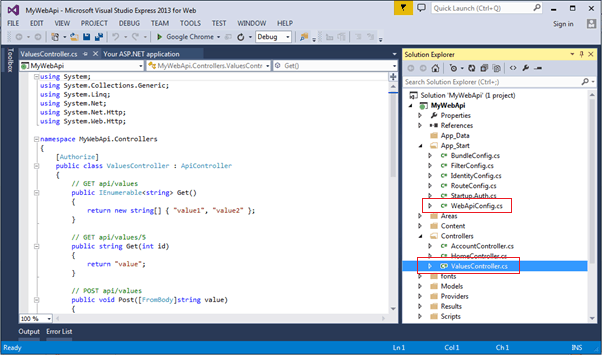

## Getting started with ASP.NET ##

### 1. How to create a ASP.NET WEB API ###


### 2. How to select web API ###


### 3. Project Structure ###
This project is same as default MVC project with two specific files for Web API, WebApiConfig.cs in <b>App_Start </b> folder and ValuesController.cs in Controllers folder as shown below.



### 4. What is inside WebApiConfig.cs and how it works? ###
```cs
using System;
using System.Collections.Generic;
using System.Linq;
using System.Web.Http;

namespace WebApplication1
{
    public static class WebApiConfig
    {
        public static void Register(HttpConfiguration config)
        {
            // Web API configuration and services

            // Web API routes
            config.MapHttpAttributeRoutes();

            config.Routes.MapHttpRoute(
                name: "DefaultApi",
                routeTemplate: "api/{controller}/{id}",
                defaults: new { id = RouteParameter.Optional }
            );
        }
    }
}
```
According to above default configuration, if we add another controller such as 
```js
using System;
using System.Collections.Generic;
using System.Linq;
using System.Net;
using System.Net.Http;
using System.Web.Http;

namespace WebApplication1.Controllers
{
    public class UserController : ApiController
    {
        public String getUser()
        {
            return "TestUser";
        }
    }
}
```
Then we can access this controller using 
```js
localhost:4345/api/user (note we need to use api because we are still using  
routeTemplate: "api/{controller}/{id}" where controller is controller name and id is optional)
```

#### 4.1 How to add new routing? ####
```cs
using System;
using System.Collections.Generic;
using System.Linq;
using System.Web.Http;

namespace WebApplication1
{
    public static class WebApiConfig
    {
        public static void Register(HttpConfiguration config)
        {
            // Web API configuration and services

            // Web API routes
            config.MapHttpAttributeRoutes();

            config.Routes.MapHttpRoute(
                name: "DefaultApi",
                routeTemplate: "api/{controller}/{id}",
                defaults: new { id = RouteParameter.Optional }
            );

            config.Routes.MapHttpRoute(
                name: "ActionApi",
                routeTemplate: "action/{controller}/{id}",
                defaults: new { id = RouteParameter.Optional });
        }
    }
}
```

### 5. How to write HTTP request such as GET, POST, PUT ? ###


### References ### 
https://www.tutorialsteacher.com/webapi/create-web-api-project
<br/>
https://www.youtube.com/watch?v=iaeHaydhatE
